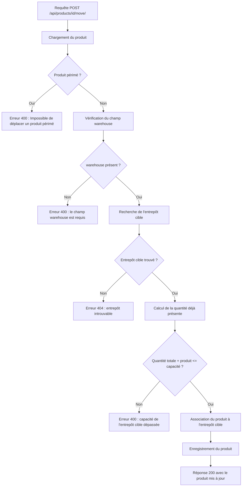

# Eco Stock API

Cette API Django REST Framework expose la gestion des entrepôts et des produits, ainsi que le transfert d'un produit vers un autre entrepôt.

## Authentification

L'API protège tous les endpoints d'écriture et de consultation par authentification JWT.

- Obtenir un token : `POST /api/token/`
- Rafraîchir un token : `POST /api/token/refresh/`

Utiliser le header suivant sur toutes les requêtes :

```http
Authorization: Bearer <token>
```

Toute requête sans token valide (absent ou expiré) reçoit une réponse `401 Unauthorized`.

## Spécification OpenAPI

```yaml
openapi: 3.0.3
info:
  title: Eco Stock API
  version: 1.0.0
  description: API de gestion des entrepôts, produits et transferts de stock.
servers:
  - url: http://localhost:8000
security:
  - bearerAuth: []
paths:
  /api/token/:
    post:
      summary: Obtenir un JWT
      security: []
      requestBody:
        required: true
        content:
          application/json:
            schema:
              type: object
              required: [username, password]
              properties:
                username:
                  type: string
                password:
                  type: string
      responses:
        '200':
          description: Token généré

  /api/token/refresh/:
    post:
      summary: Rafraîchir un JWT
      security: []
      requestBody:
        required: true
        content:
          application/json:
            schema:
              type: object
              required: [refresh]
              properties:
                refresh:
                  type: string
      responses:
        '200':
          description: Nouveau token généré
        '401':
          description: Refresh token invalide ou expiré

  /api/warehouses/:
    get:
      summary: Lister les entrepôts
      responses:
        '200':
          description: Liste des entrepôts
        '401':
          description: Authentification requise
    post:
      summary: Créer un entrepôt
      requestBody:
        required: true
        content:
          application/json:
            schema:
              $ref: '#/components/schemas/WarehouseInput'
      responses:
        '201':
          description: Entrepôt créé
        '401':
          description: Authentification requise

  /api/warehouses/{id}/:
    get:
      summary: Récupérer un entrepôt
      parameters:
        - $ref: '#/components/parameters/IdParam'
      responses:
        '200':
          description: Détail de l'entrepôt
        '401':
          description: Authentification requise
        '404':
          description: Entrepôt introuvable
    put:
      summary: Mettre à jour un entrepôt
      parameters:
        - $ref: '#/components/parameters/IdParam'
      requestBody:
        required: true
        content:
          application/json:
            schema:
              $ref: '#/components/schemas/WarehouseInput'
      responses:
        '200':
          description: Entrepôt mis à jour
        '401':
          description: Authentification requise
        '404':
          description: Entrepôt introuvable
    delete:
      summary: Supprimer un entrepôt
      parameters:
        - $ref: '#/components/parameters/IdParam'
      responses:
        '204':
          description: Entrepôt supprimé
        '401':
          description: Authentification requise
        '404':
          description: Entrepôt introuvable

  /api/warehouses/{id}/audit/:
    get:
      summary: Obtenir le nombre de produits d'un entrepôt
      parameters:
        - $ref: '#/components/parameters/IdParam'
      responses:
        '200':
          description: Nombre de produits
          content:
            application/json:
              schema:
                type: object
                properties:
                  nb_product:
                    type: integer
        '401':
          description: Authentification requise
        '404':
          description: Entrepôt introuvable

  /api/products/:
    get:
      summary: Lister les produits
      responses:
        '200':
          description: Liste des produits
        '401':
          description: Authentification requise
    post:
      summary: Créer un produit
      requestBody:
        required: true
        content:
          application/json:
            schema:
              $ref: '#/components/schemas/ProductInput'
      responses:
        '201':
          description: Produit créé
        '401':
          description: Authentification requise

  /api/products/{id}/:
    get:
      summary: Récupérer un produit
      parameters:
        - $ref: '#/components/parameters/IdParam'
      responses:
        '200':
          description: Détail du produit
        '401':
          description: Authentification requise
        '404':
          description: Produit introuvable
    put:
      summary: Mettre à jour un produit
      parameters:
        - $ref: '#/components/parameters/IdParam'
      requestBody:
        required: true
        content:
          application/json:
            schema:
              $ref: '#/components/schemas/ProductInput'
      responses:
        '200':
          description: Produit mis à jour
        '401':
          description: Authentification requise
        '404':
          description: Produit introuvable
    delete:
      summary: Supprimer un produit
      parameters:
        - $ref: '#/components/parameters/IdParam'
      responses:
        '204':
          description: Produit supprimé
        '401':
          description: Authentification requise
        '404':
          description: Produit introuvable

  /api/products/{id}/move/:
    post:
      summary: Transférer un produit vers un autre entrepôt
      description: >-
        Valide les règles métier avant de déplacer un produit.
        Le produit ne doit pas être périmé, l'entrepôt cible doit exister,
        et la capacité de l'entrepôt cible ne doit pas être dépassée.
      parameters:
        - $ref: '#/components/parameters/IdParam'
      requestBody:
        required: true
        content:
          application/json:
            schema:
              type: object
              required: [warehouse]
              properties:
                warehouse:
                  type: integer
                  description: Identifiant de l'entrepôt cible
      responses:
        '200':
          description: Produit déplacé avec succès
          content:
            application/json:
              schema:
                $ref: '#/components/schemas/Product'
        '400':
          description: >-
            Erreur métier (produit périmé, champ warehouse manquant,
            ou capacité de l'entrepôt cible dépassée)
          content:
            application/json:
              schema:
                $ref: '#/components/schemas/ErrorResponse'
        '401':
          description: Authentification requise
        '404':
          description: Produit ou entrepôt cible introuvable
components:
  securitySchemes:
    bearerAuth:
      type: http
      scheme: bearer
      bearerFormat: JWT
  parameters:
    IdParam:
      name: id
      in: path
      required: true
      schema:
        type: integer
  schemas:
    Warehouse:
      type: object
      properties:
        id:
          type: integer
        name:
          type: string
        localisation:
          type: string
        capacity:
          type: integer
    WarehouseInput:
      type: object
      required: [name, localisation, capacity]
      properties:
        name:
          type: string
        localisation:
          type: string
        capacity:
          type: integer
    Product:
      type: object
      properties:
        id:
          type: integer
        name:
          type: string
        quantity:
          type: integer
        expiration_date:
          type: string
          format: date
        status:
          type: string
          enum: [disponible, reserve, perime]
        warehouse:
          type: integer
    ProductInput:
      type: object
      required: [name, quantity, expiration_date, status, warehouse]
      properties:
        name:
          type: string
        quantity:
          type: integer
        expiration_date:
          type: string
          format: date
        status:
          type: string
          enum: [disponible, reserve, perime]
        warehouse:
          type: integer
    ErrorResponse:
      type: object
      properties:
        error:
          type: string
```

## Flux métier du transfert

Le transfert d'un produit suit ce flux métier avant validation finale :



### Règles de validation métier

Avant d'effectuer le transfert, l'API vérifie les points suivants, dans cet ordre :

1. L'utilisateur est authentifié (sinon `401`).
2. Le produit n'est pas périmé (`status != perime`, sinon `400`).
3. Le champ `warehouse` est présent dans la requête (sinon `400`).
4. L'entrepôt cible existe (sinon `404`).
5. L'ajout du produit ne dépasse pas la capacité de l'entrepôt cible (sinon `400`).

### Exemple de requête

```http
POST /api/products/1/move/
Content-Type: application/json
Authorization: Bearer <token>

{
  "warehouse": 2
}
```

### Exemple de réponse réussie

```json
{
  "id": 1,
  "name": "Produit A",
  "quantity": 10,
  "expiration_date": "2026-12-31",
  "status": "disponible",
  "warehouse": 3
}
```

### Exemple de réponse en erreur (produit périmé)

```json
{
  "error": "Impossible de déplacer un produit périmé"
}
```